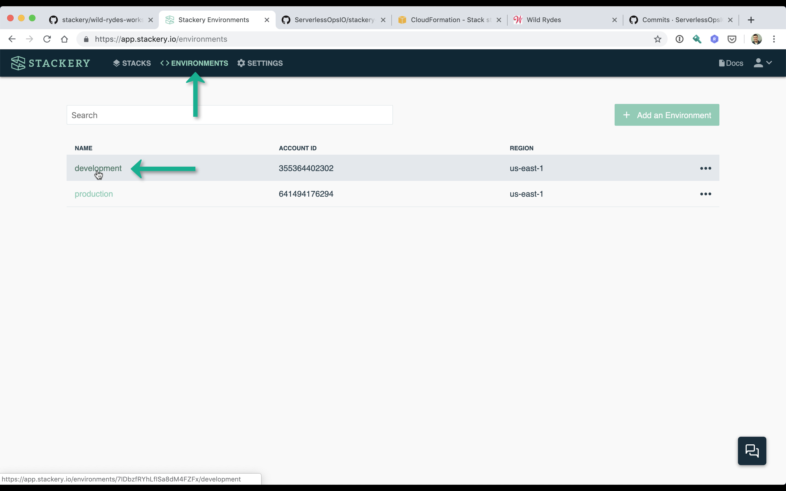
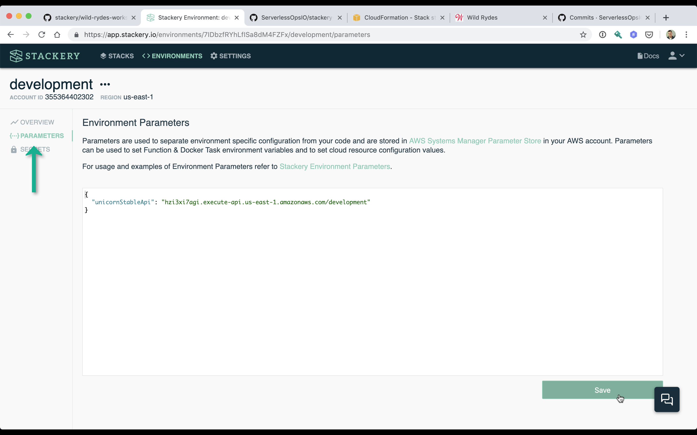
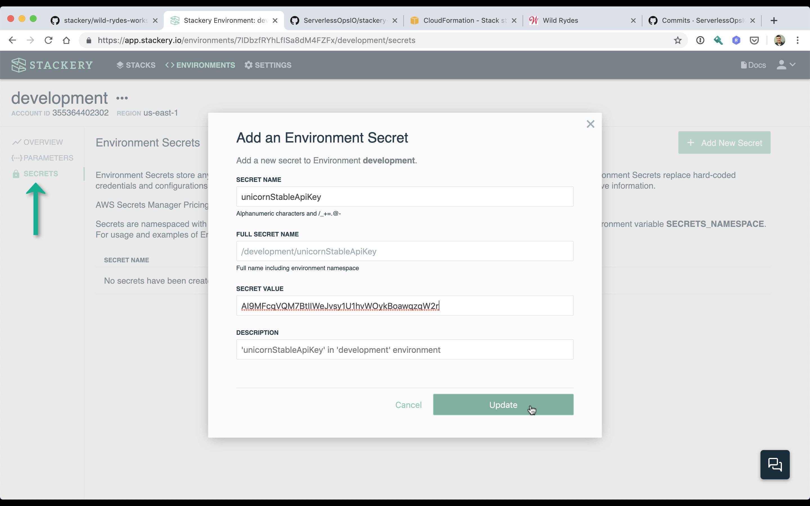

# Environment Parameters
You will now manage *Wild Rydes* application configuration using *Environment Parameters*. This configuration is specific to the *development* environment. At a later point in this workshop you will add similar configuration but for the *production* environment.

In the next module you will provision a backend API for requesting unicorns sent to users on demand. The API will rent unicorns from a third party Unicorn Stables™ service. The service provides both development and production API endpoints and your function will need to know the correct value depending on whether it's the *development* or *production* deployment of the application.

Through the use of Stackery environments in this module, you will define the API endpoint for the *development* service instance. When you get to creating the *Wild Rydes* backend API service you will configure a Lambda function environmental variable that will use this value.

You'll then handle the management of the Unicorn Stables™ backend API keys. Instead of using *Environment Parameters* you'll use Stackery *Environment Secrets* which will store the API key value in AWS Secrets Manager which gives you greater control over who can access the key. This is because unlike the Unicorn Stables™ backend API endpoint, API keys are considered sensitive. Should these credentials be leaked to the wrong person they could order unicorns we did not intend to order. This means we want to restrict access to them, even internally.

## AWS Services
<!-- FIXME: link to Stackery resource docs? -->
* AWS Systems Manager (SSM) Parameter Store.
* AWS Secrets Manager

## Instructions
### 1. Add an Environment Parameter for Unicorn Stable API.
Click on **ENVIRONMENTS** at the top of the Stackery screen to be brought to your list of AWS environments. Click on the *development* environment.




Then on the left sidebar click on **PARAMETERS**. *Environment Parameters* is a JSON formatted key value pair. The current value should be "_{}_". Replace the contents of *Environment Parameters* with the following:

```JSON
{
  "unicornStableApi": "hzi3xi7agi.execute-api.us-east-1.amazonaws.com/development"
}
```

Once you have done that, click the **Save** button in the lower right. This will save the contents of *Environment Parameters* as parameters in AWS SSM Parameter Store.




### 2. Add an Environment Secret for the API key

Now click on **SECRETS** in the left sidebar. *Environment Secrets* section. Click the **Add New Secret** button on the right. In the new screen that appears enter the following and then click the **Update** button.

* **SECRET NAME:** *unicornStableApiKey*
* **SECRET VALUE**: *AI9MFcqVQM7BtIIWeJvsy1U1hvWOykBoawqzqW2r*



## Next Steps

Proceed to the next module in this workshop:

* [Backend API](./04-backend-api.md)

